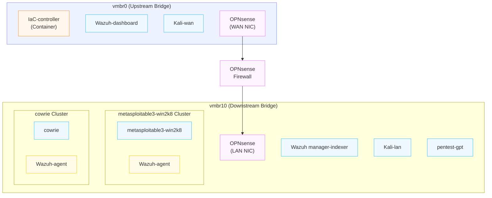
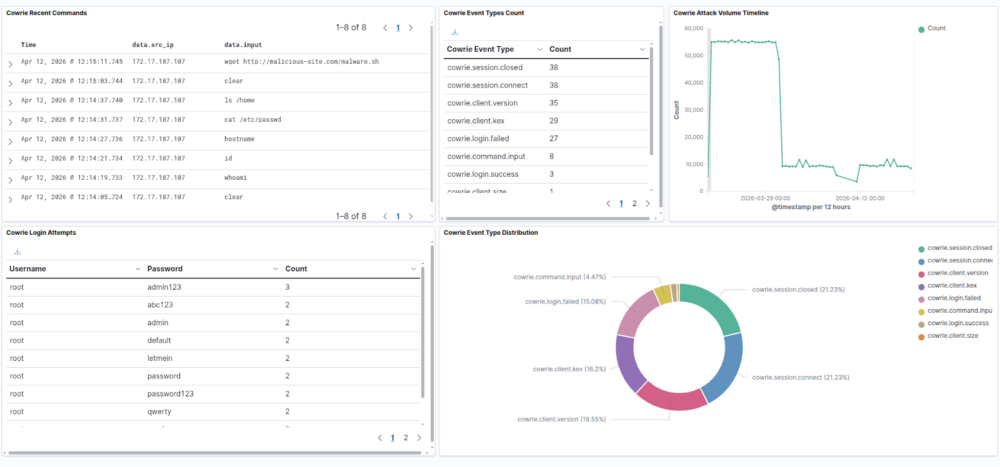

# V-SOC

V-SOC is an infrastructure-as-code platform that deploys a complete, ephemeral SOC lab environment — SIEM, firewall, honeypot, victims, Kali and a pentest gpt box — on Proxmox (QEMU/KVM) in ~8 minutes, and tears it down in less. It's built for hands-on red team / blue team security education: an instructor provisions a fresh, isolated environment per lesson, assigns offensive and defensive roles to students, and destroys it afterward to free cluster resources.

Designed around Miami University's virtualization cluster, V-SOC uses golden images and a single-command Terraform + Ansible pipeline, so the entire lab — network segmentation, SIEM stack, Wazuh & Suricata detection rulesets, and agents — comes up configured and ready rather than requiring manual setup.

## Architecture

The environment is split across two bridges: an upstream segment (vmbr0) holding the management plane and external attacker, and a downstream lab segment (vmbr10) behind an OPNsense firewall containing the victims, honeypot, and internal attacker. The OPNsense instance routes and filters between them, giving a realistic network boundary for exercises. The management domain originates at the IaC controller and flows downstream.

## Capabilities
V-SOC uses a combination of Wazuh agents, Suricata IDS, and Cowrie honeypots to detect malicious activity. Telemetry is communicated to the indexer using syslog and displayed in Wazuh dashboards. See below for a dashboard reporting from a SSH-login dictionary attack.



#### OPNsense & Suricata
OPNsense is the only path between vmbr0 and vmbr10. All inter-subnet traffic is monitored by Suricata, which runs on OPNsense. Suricata inspects lab traffic and forwards EVE JSON events into Wazuh, correlating network-layer detections with host events.

#### Cowrie
Runs a SSH-honeypot to capture attacker behavior as displayed above.

#### Wazuh Agents
Fully-functional agents are implemented with capabilities such as data collection, file integrity monitoring, threat detection, security configuration assessment, system inventory, vulnerability detection, and incident response. V-SOC puts agents in the default group. attacks/soc_demo_runbook.docx describes a WannaCry style ransomware attack via the EternalBlue exploit, which the agents reported.

## Teaching Use Cases

V-SOC ships as infrastructure with sane-default, largely unconfigured tooling —
not a fixed lesson. The detection stack comes up functional but untuned, which
is deliberate: the blank slate *is* the coursework. This lets one platform
support a wide span of activity and skill levels, from a first-day
demonstration to capstone-level detection engineering.

Lesson-plan specific snapshots can be taken of the base golden images and IaC code,
then organized into versions on an as-needed basis.

**Instructor-led demonstration.** The instructor runs the full attack pipeline
from a Kali box while students watch it surface across the defensive outputs —
Suricata network events and Wazuh host alerts appearing in the dashboards in
real time. This is the "here's what an intrusion looks like from both ends at
once" lesson, and the lowest-setup way to make the red-and-blue relationship
legible.

**Role-assigned exercises.** Students take defined roles — offense from the
Kali platforms, defense reading alerts and triaging in Wazuh — and run against
the instructor, against each other, or against a scripted scenario. Because
each environment is isolated and ephemeral, groups can work in parallel or
reset a scenario cleanly between rounds.

**Detection engineering.** The deepest tier: students configure the tools
rather than just operate them — authoring and tuning Wazuh rules, adjusting
Suricata signatures, and building out the dashboards from the default state.
The reflexive version closes the loop: red-side students engineer an attack
pipeline against the defensive telemetry they can observe, iterating to evade
or deliberately trigger specific detections, while blue-side students tune
rules to catch them. Attack and detection co-evolve on the same platform.

## Deployment Workflow
For deployment, this repo is meant to be cloned into the IaC controller, and the script deployment/shell/deploy.sh is to be run. Deployment is orchestrated between Terraform and Ansible between bootstrapping and main stages.

#### Bootstrap Stage
Terraform files at deployment/terraform/network-init/{network_resources.tf, OPNsense.tf} are applied to provision the LAN bridge and clone the firewall to a bootstrap wan IP. Then Ansible is used to configure OPNsense, including a static primary IP address allocation.

#### Main Stage
Terraform is run from the deployment/terraform/main directory to provision clones for all other instances. Then, Ansible is run to make all necessary configurations of these instances. Wazuh agent enrollment marks the end of deployment.

## Repository Structure
See a simplified representation of our functional directory tree.
```
├── deployment/
│   ├── terraform/          # Phase 1: provisioning (bpg provider)
│   │   ├── network-init/   #   OPNsense + bridges, applied first
│   │   └── main/           #   victim/attacker/Wazuh VMs from golden images
│   ├── ansible/            # Phase 2: configuration
│   │   ├── playbooks/      #   Wazuh manager/indexer/dashboard, OPNsense LAN
│   │   ├── files/          #   Jinja2 templates (ossec, filebeat, opensearch…)
│   │   └── group_vars/     #   per-host + shared variables
│   └── shell/              # Deploy/destroy wrapper orchestrating both phases
├── attacks/                # Red-team runbook driving the demo scenario
├── documents/
│   ├── manual-ops-guide/   # Standalone deployment + SIEM/EDR PDFs
│   └── images/
└── README.md
```

## Environment & Dependencies

V-SOC is designed for a specific Proxmox environment and is not a turnkey deploy on arbitrary hardware. It assumes:

- A **Proxmox Cluster** with the unmanaged upstream bridge (`vmbr0`) already present.
- A set of **secrets files** obfuscated with either symlinks or gitignore.
- The **IaC Controller** created out-of-band and runs the pipeline and possesses the secret files.
- A set of **Golden Images** as Proxmox templates

| Component | Base OS | Segment | IP assignment | Cloud-init | Role |
|---|---|---|---|---|---|
| ansible-terraform-lxc | Ubuntu 25.04 (LXC) | WAN | Manual | No | IaC controller — Terraform/Ansible orchestration |
| OPNsense-swan | FreeBSD | WAN + LAN | Static — bootstrap `x.x.x.228`, then user-set | No | Firewall, DHCP server, IDS platform |
| Wazuh-dashboard | Ubuntu 25.10 | WAN | Static | Yes | Wazuh dashboard / management console |
| Wazuh-indx-mngr | Ubuntu 25.10 | LAN | Static | Yes | Wazuh indexer + manager |
| ms3-win2k8 | Metasploitable3 Win2k8 (Rapid7) | LAN | DHCP | No | Vulnerable target (Wazuh agent installed) |
| cowrie | Ubuntu 25.10 | LAN | Static | Yes | SSH honeypot |
| Kali-wan | Kali Linux | WAN | Static | Yes | Red-team platform (external) |
| Kali-lan | Kali Linux | LAN | Static | Yes | Red-team platform (internal) |
| pentest-gpt | Ubuntu 25.10 | LAN | Static | Yes | Red-team agentic platform (internal)|

All VMs other than the lxc are part of the managed pipeline. In order to migrate to another cluster, one would need to migrate the related Golden Images. Then, api keys, ansible_vars.yml, terraform.tfvars, SSH keyfiles, and a new SSH config enumerating the hosts in the ansible inventory would need to be created, with terraform referencing a new set of keys in "../keyfile.pem". Furthermore, this should include a Proxmox vault, and pentest gpt vault to be made, including new api keys.

**SSH Config Template**
```
Host prox_fw
  HostName ip
  User root
  IdentityFile ~/.ssh/id_ed25519
  IdentitiesOnly yes

Host prox_idx
  HostName ip
  User u
  ProxyJump prox_fw
  IdentityFile ~/.ssh/id_ed25519
  IdentitiesOnly yes

Host prox_dash
  HostName ip
  User u
  IdentityFile ~/.ssh/id_ed25519
  IdentitiesOnly yes

Host prox_pentest
  HostName ip
  User u
  IdentityFile ~/.ssh/id_ed25519
  IdentitiesOnly yes

Host prox_cowrie
  HostName ip
  User u
  IdentityFile ~/.ssh/id_ed25519
  IdentitiesOnly yes
```


## Documentation
- **Design approach, decisions, attributes**
    - documents/design-choices.md
- **Manual Deployment procedure in command format**
    - documents/manual-deployment.md
## Limitations & Notes
One difficulty of this project was that we migrated platforms from Openstack to Proxmox half way through the year. As such we have a few limitations.

- **Upstream DHCP**
  - vmbr0 was deliberately left as an unmanaged dependency of the project for better encapsulation. However, 
  because it is unmanaged, the dhcp server responsible for vmbr0 should be configured to exclude x.x.x.228(the bootstrap ip of the opnsense template)
  - the opnsense template can be reconfigured to any new static ip then retemplated for a new environment

- **Scale**
  - Right now deploy.sh wraps the deployment of a single network topology, as aligned with our project requirements and roadmap. However, a further encapsulating program can be created to generate several adjacent V-SOC topologies originating from vmbr0. Accepting a list of topology names whitespace separated, generating and proliferating associated subnets and ip addresses, and exporting documentation for the various generated topologies.  This should be more convenient for a groups-allocated-topology lesson plan.

- **Wazuh Dashboards**
  - We have a Cowrie Dashboard, and a General Student Dashboard for IDS and EDR. However, they could use some polishing under the eve json syslog indexing scheme we ended up implementing.

- **Metasploitable** is very difficult to work with in a virtualized environment on account of being so old. For example, they do not accept qemu agents, and getting network connectivity and Wazuh agents installed was a hack.
  - **Win2k8** Sometimes needs a manual opening of its desktop interface from the Proxmox console before sending a DHCP Discover (requesting a ip address from OPNsense). This must be done before its Wazuh agent is enrolled to the server.
  - **Trusty** We were not able to get the trusty ms3 cloudimage to get proper network connectivity via dhcp, especially since it was low priority. Windows is generally the preferred target for metasploitable3.