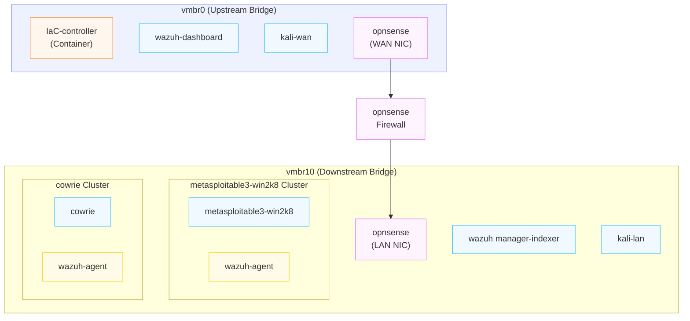

# Overview

# Dependencies

This project was designed around a specific proxmox environment for Miami University. Therefore the repository assumes a set of Golden-Image Dependencies necessary for deployment, and a set of secrets within the host machine running deployment that are not included in the repo. All of which will be enumerated and explained.

